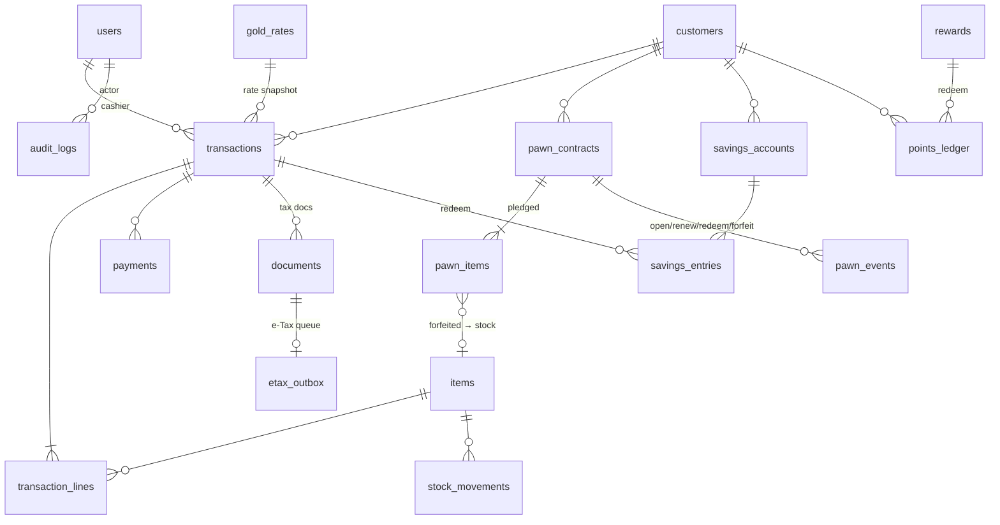

# Sola — Database Schema Design

Source of truth: `apps/api/src/db/schema.ts` (append-only migrations tracked by `PRAGMA user_version`).
SQLite today; every table uses plain SQL types so the same DDL ports to PostgreSQL (swap `INTEGER PRIMARY KEY` → `BIGINT GENERATED ALWAYS AS IDENTITY`, TEXT timestamps → `timestamptz`).

## Design rules

| Rule | Why |
|---|---|
| **Money = integer minor units** (satang). Never floats. | Exact totals, tax, and reconciliation. |
| **Weight = integer milligrams** (`weight_mg`). Baht-weight = 15,244 mg. | Gold is traded by weight; no rounding drift. |
| **Purity = integer basis points** (`purity_bp`): 96.5 % = 9650, 99.99 % = 9999. | Handles karat, 96.5 %, 99.99 % uniformly. |
| **Rates are per gram of *pure* gold**, in two classes: ornament and bar. | Value = weight × purity × rate. Association quotes (per baht-weight @96.5 %) are converted on ingest. |
| **History is append-only**: `gold_rates`, `stock_movements`, `pawn_events`, `savings_entries`, `points_ledger`, `audit_logs`. | Auditable; balances can always be re-derived. |
| **Transactions snapshot** the rate ids/values, item cost and totals. | Later rate changes never alter past documents; profit uses historical cost. |
| **Voids, not deletes.** Status flips + reversing movements/entries. | Audit trail; tax documents are cancelled, not removed. |
| One **physical piece = one `items` row**; customer trade-in gold and forfeited pawn gold become items too (`source`). | One stock model; stock by purity/type is a simple `GROUP BY`. |

## ER overview

## Tables by module

### Core / security
- **users** — `role` ∈ OWNER, MANAGER, CASHIER, STOCK_CLERK; permissions map lives in `@sola/core` (`ROLE_PERMISSIONS`), checked on every route. `active` allows instant deactivation.
- **settings** — key/value: shop identity (`shop_name`, `shop_tax_id`, `shop_address`, `shop_branch`), `tax_rate_bp`, `tax_mode` (NONE | MAKING_ONLY | FULL), pawn limits, points rule.
- **audit_logs** — who did what: login attempts, rate changes, item edits, voids, pawn/savings actions, settings.

### Pricing
- **gold_rates** — append-only. `buy/sell_per_gram` (ornament) and `bar_buy/bar_sell_per_gram`, `source` (MANUAL | ASSOCIATION), `announcement_no`. Latest row = current rate. Intraday changes are just new rows.

### Inventory
- **items** — one per physical piece: `sku`, `category` (RING, CHAIN, BAR, SCRAP, FORFEITED…), `weight_mg`, `purity_bp`, making charge (`making_type` FIXED | PER_GRAM | PERCENT + `making_value`), `other_charge`, `cost`, `status` (IN_STOCK, SOLD, RESERVED, MISSING, VOIDED), `source` (NEW | TRADE_IN | FORFEITED).
- **stock_movements** — every status change: RECEIVE, SALE, TRADE_IN_RECEIVE, FORFEIT_RECEIVE, VOID_RETURN, VOID_REMOVE, ADJUST.
- Stock by purity / type / source = `GROUP BY purity_bp, category, source` (see `stockSummary`, dashboard).

### Sales (buy · sell · exchange in one screen)
- **transactions** — `type` SALE | TRADE_IN (exchange) | BUYBACK; totals (`gold_total`, `making_total`, `other_total`, `discount`, `tax`, `sale_total`, `trade_in_credit`, `net`); `net > 0` customer pays, `< 0` shop pays; rate snapshot; `points_earned`; void metadata.
- **transaction_lines** — `kind` SALE (links to item) or TRADE_IN (creates a stock item); gold value, making, deduction, `cost` snapshot.
- **payments** — signed amounts; methods CASH, CARD, TRANSFER, SAVINGS, OTHER; split payments supported.
- **doc_sequences** — gap-free per-day/per-year counters for document numbers.

### Pawn / sell-back (ขายฝาก / จำนำ)
- **pawn_contracts** — `type` PAWN | SELL_BACK, `principal`, `rate_bp_per_month`, `term_days`, `start_date`, `due_date`, `interest_paid_to` (interest settled through this date), `status` ACTIVE | REDEEMED | FORFEITED.
- **pawn_items** — pledged pieces; `stock_item_id` set when forfeited into stock.
- **pawn_events** — OPEN, RENEW (ต่อดอก), PAY_PRINCIPAL, REDEEM (ไถ่ถอน), FORFEIT (หลุดจำนำ) with principal/interest split — the basis for interest-income reporting.
- Interest = simple, `principal × monthly bp × days / 30`, optional minimum days. Forfeiture creates `items` (`source = FORFEITED`) with the principal allocated as cost.

### Savings (ออมทอง)
- **savings_accounts** — `plan` FIXED (installment + WEEKLY/MONTHLY) or FLEXIBLE; `mode` CASH (money balance) or GOLD_WEIGHT (each deposit converted to mg at that day's sell rate); optional target.
- **savings_entries** — DEPOSIT, REDEEM (used as a payment, linked to a transaction), REFUND (void or account closure). Statement endpoint returns everything needed to print the savings ticket + next due date.

### Membership & points
- **customers** — Thai-ID-card-reader fields (`national_id`, `title`, `name_en`, `birth_date`, issue/expiry, `id_source`), `member_no`, `points_balance`.
- **points_ledger** — EARN / REDEEM / ADJUST / VOID (balance cached on customer, ledger is the source of truth).
- **rewards** — catalogue with point cost and stock.

### Tax & documents
- **documents** — `TAX_INVOICE_ABBR` (ใบกำกับภาษีอย่างย่อ, auto), `TAX_INVOICE_FULL` (on request with buyer tax id), `PURCHASE_VOUCHER` (when the shop buys gold), `CREDIT_NOTE`; seller snapshot JSON; cancelled on void.
- **etax_outbox** — queue of documents awaiting submission (PENDING → SENT/FAILED). A connector worker drains it; see "Not yet built".

### Back office
- **ledger_entries** — manual INCOME / EXPENSE (rent, salary, utilities). Reports combine sales (net of VAT), COGS from line cost snapshots, pawn interest, and ledger entries into P&L; dashboard adds stock value, active/overdue pawns, savings liability, outstanding points, pending e-Tax.

## Not yet built / needs decisions
- **ID-card reader**: the API accepts card fields (`idSource = CARD_READER`); the reader itself is a browser/desktop agent (PC/SC) the web UI must call locally.
- **e-Tax / Revenue Dept submission**: queue and documents exist; the actual connector depends on the provider/certificate you choose.
- **Association price feed**: `POST /rates/association` and an optional `RATE_FEED_URL` poller accept per-baht quotes; you need to point it at a source you are licensed to use.
- **Legal parameters** (pawn interest cap, grace periods, VAT treatment of gold — margin scheme vs. making-only) are settings, with placeholder defaults. Have an accountant confirm before go-live.
- Supplier purchasing, multi-branch, cash-drawer shifts, receipt printing templates.
